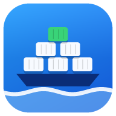

# ddashboarda



An Android app to manage Docker containers and Compose stacks on your servers over SSH.
It is the Android version of **ddashboard**, a Windows desktop app.

Built with Rust and [Slint](https://slint.dev). There is no server-side agent: the app runs
`docker` commands on the host over SSH.

## Features

- **Several connections**: save multiple hosts and switch between them from the top bar.
- **Stacks at a glance**: containers are grouped by Compose project, with green/amber/red
  status dots and a running/total count.
- **Start / Stop / Restart** on any stack or container.
  - Stop on a stack runs `docker compose down`.
  - Start runs `docker compose up -d` from the stack's remembered compose files, so stacks
    you brought down can be started again.
- **Down stacks are remembered**. Tap **Forget** to drop one from the list.
- **Port chips**: tap `8080` on a container to open it in the phone's browser
  (`https` for 443 / 8443 / 9443).
- **Password or key login**: the app generates its own SSH key, which you can copy from the
  Connections page.
- **Light / dark / system theme**.

## Install

1. Download `ddashboarda.apk` from the latest [release](../../releases/latest).
2. Open it on your phone. Allow "install unknown apps" when Android asks.
3. Open **ddashboard**. The Connections page opens on first start.

It needs Android 8.0 or newer on a 64-bit ARM phone (`arm64-v8a`), which covers nearly all
phones from recent years.

## Setting up a connection

Fill in **Name**, **User** and **IP address**, then either:

- **Password login**: enter the SSH password, or
- **Key login**: leave the password empty, tap **Copy key**, and add that line to
  `~/.ssh/authorized_keys` on the server.

The SSH user must be able to run `docker` (for example, be in the `docker` group).

On the first connection the app trusts the server's host key and remembers it. If the key
changes later, the app refuses to connect.

## Building

The APK is built by GitHub Actions ([`.github/workflows/android.yml`](.github/workflows/android.yml))
on every push, so you don't need the Android SDK on your own machine.

To build locally instead, you need the Android SDK and NDK, plus:

```sh
rustup target add aarch64-linux-android
cargo install cargo-apk
cargo apk build --lib --release
```

`cargo test` runs the unit tests (docker output parsing, compose commands, config, SSH key) on
your PC.

## Project layout

| Path | What |
|---|---|
| `src/lib.rs` | App logic: SSH (`russh`), `docker ps` parsing, stack grouping, actions, Android entry point |
| `src/config.rs` | Saved connections, remembered stacks, the app's SSH key and known hosts |
| `ui/app.slint` | The whole UI |
| `build.rs` | Compiles the UI and renders the in-app icon |
| `res/` | Launcher icons |

## Limitations

- SSH always uses port 22.
- No RSA keys (ed25519 / ECDSA host keys are fine, which covers modern servers).
- Passwords are stored unencrypted in the app's private storage, which other apps can't read.

## Credits

Designed and built together with **[Claude](https://claude.com/claude-code)** (Anthropic's AI
coding assistant, via Claude Code). Claude ported the Windows app to Android: it rewrote the
SSH layer, adapted the UI for touch, set up the GitHub Actions APK build and worked through
the CI failures. Kudos, Claude. 🤖
